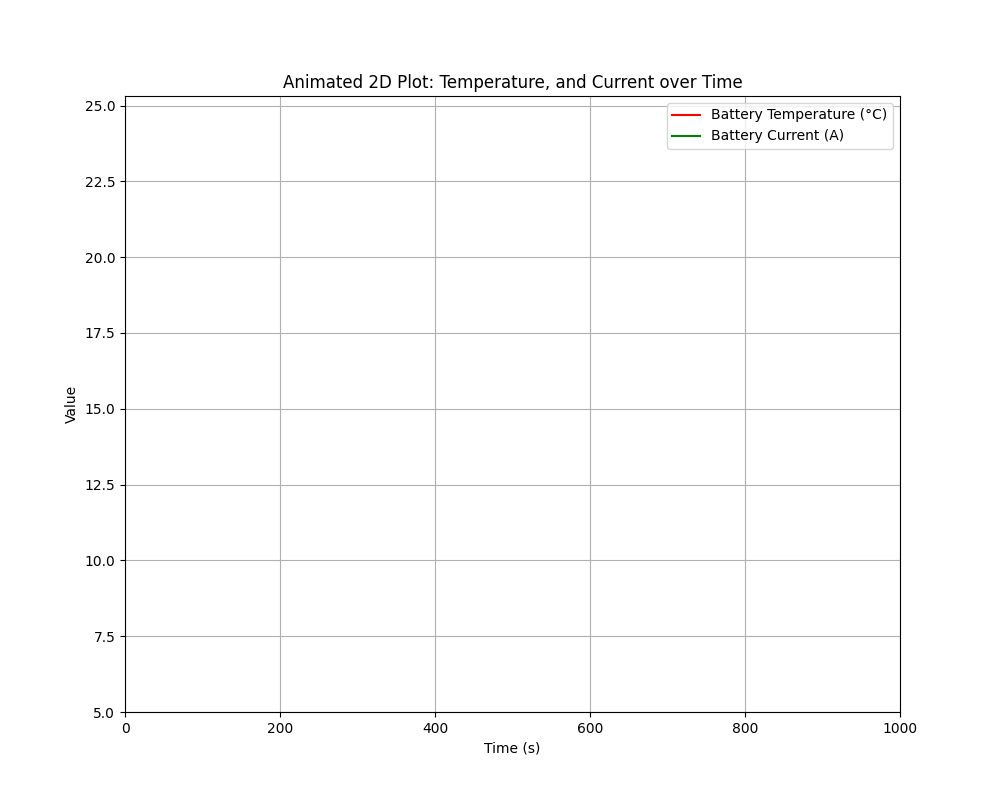
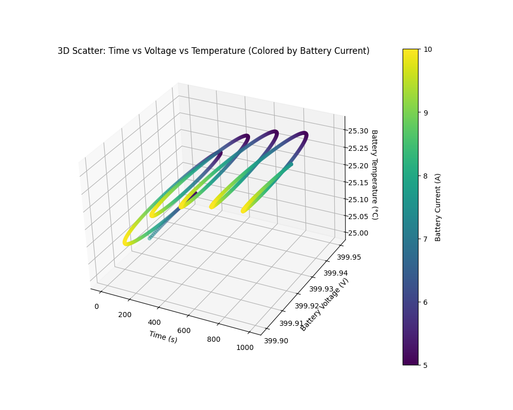

# Electric Vehicle Drivetrain & Battery Thermal Simulation

This project demonstrates an end-to-end simulation of a simplified electric vehicle (EV) drivetrain and battery thermal management system using OpenModelica and Python. The simulation models an electric motor with a sinusoidal speed variation, a battery with voltage drop due to internal resistance, and a battery thermal model that captures temperature changes due to Joule heating.

The project also includes code to visualize the simulation results using two types of plots:

- A **3D scatter plot** that shows the interplay between time, battery voltage, and battery temperature, with battery current represented by color.
- An **animated 2D plot** that displays how battery voltage, temperature, and current evolve over time.

Both plots are saved as artifacts:

- **EVSimulation.png:** A snapshot of the 3D scatter plot.
- **animation.gif:** An animated GIF of the 2D time-series plot.




---

## Table of Contents

- [Overview](#overview)
- [Project Components](#project-components)
  - [Electric Motor Model](#electric-motor-model)
  - [Battery Model](#battery-model)
  - [Battery Thermal Model](#battery-thermal-model)
  - [EV Simulation Model](#ev-simulation-model)
- [Installation and Requirements](#installation-and-requirements)
- [How to Run the Simulation](#how-to-run-the-simulation)
- [Visualization](#visualization)
- [Artifacts](#artifacts)
- [Analogy and Explanation](#analogy-and-explanation)
- [Project Structure](#project-structure)
- [Conclusion](#conclusion)

---

## Overview

This project builds a simulation of an EV drivetrain with battery thermal management. The simulation uses Modelica (via OpenModelica) to represent the physics of the system and OMPython to run and extract results. In our simulation:

- The **electric motor's speed** is defined as a sinusoidal function to mimic varying operating conditions (similar to riding a bike over gentle, rolling hills).
- The **motor torque** depends on the motor speed, decreasing linearly as speed increases.
- The **battery current** is computed based on the motor’s torque, and because torque follows a sinusoidal pattern, so does the current.
- The **battery voltage** drops slightly when current flows (due to internal resistance), and the **battery temperature** changes because of the heat generated from current (Joule heating).

---

## Project Components

### Electric Motor Model

- **Description:**  
  Computes torque as a function of speed. As speed increases, torque decreases linearly.
- **Key Equation:**  
  \[
  \text{torque} = \text{maxTorque} \times \Bigl(1 - \frac{\text{speed}}{\text{speedNominal}}\Bigr)
  \]

### Battery Model

- **Description:**  
  Supplies power to the motor. Its voltage is reduced by a drop proportional to the current (due to internal resistance).
- **Key Equation:**  
  \[
  \text{voltage} = \text{voltageNominal} - \text{current} \times \text{internalResistance}
  \]

### Battery Thermal Model

- **Description:**  
  Captures the battery’s temperature dynamics through an energy balance that considers heat generation and dissipation.
- **Key Equation:**  
  \[
  \text{heatCapacity} \times \frac{d(\text{temperature})}{dt} = \text{heatGeneration} - \frac{(\text{temperature} - \text{ambientTemperature})}{\text{thermalResistance}}
  \]

### EV Simulation Model

- **Description:**  
  The top-level model integrates the motor, battery, and battery thermal models.
- **Sinusoidal Speed:**  
  The motor speed is set as:
  \[
  \text{motor.speed} = \text{baseSpeed} + \text{amplitude} \cdot \sin(2\pi \cdot \text{frequency} \cdot \text{time})
  \]
- **Interaction:**  
  This sinusoidal input causes the motor torque to vary, which then determines the battery current (scaled by a gain). Consequently, battery voltage and temperature change as a result of the varying current.

---

## Installation and Requirements

1. **OpenModelica:**

   - Download and install OpenModelica from [openmodelica.org](https://openmodelica.org).

2. **Python & OMPython:**

   - Ensure Python is installed.
   - Install required packages:
     ```bash
     pip install OMPython pandas matplotlib
     ```

3. **Additional Tools for Animation:**
   - To save the animated plot as a GIF, you might need `ffmpeg` or `imagemagick`.

---

## How to Run the Simulation

1. **Modelica Code Generation:**  
   The Python script writes the Modelica code into `EVSimulation.mo`.

2. **Running the Simulation:**  
   The script uses OMPython to:

   - Load the Modelica file.
   - Instantiate the model.
   - Run the simulation for 1000 seconds (with 1-second resolution) and output the results in a CSV file.

3. **Command:**  
   Run the Python script:
   ```bash
   python ev_simulation.py
   ```

---

## Visualization

The script creates two types of visualizations:

### 3D Scatter Plot

- **Axes:**
  - X-axis: Time (s)
  - Y-axis: Battery Voltage (V)
  - Z-axis: Battery Temperature (°C)
- **Color:**  
  Battery Current (A) is encoded as the color.
- **Artifact:**  
  The plot is saved as `EVSimulation.png`.

### Animated 2D Plot

- **Purpose:**  
  Shows how battery voltage, temperature, and current evolve over time.
- **Details:**  
  Three lines are animated on the same plot to illustrate the time-dependent behavior.
- **Artifact:**  
  The animation is saved as `animation.gif`.

---

## Artifacts

After running the simulation and visualization script, you will obtain:

- **EVSimulation.png:**  
  A snapshot of the 3D scatter plot.
- **animation.gif:**  
  An animated 2D plot showing how the system variables change over time.

---

## Analogy and Explanation

Imagine you are riding a bike on a road with gentle, rolling hills. Here’s the analogy:

- **Riding Over Hills (Sinusoidal Speed):**  
  Just like your speed increases when riding downhill and decreases uphill, our motor speed is set to vary in a smooth, wave-like (sinusoidal) manner. This simulates natural ups and downs in operating conditions.

- **Effort (Torque):**  
  When you pedal harder on an uphill stretch, your effort increases. Similarly, the motor's torque changes as its speed varies. The torque decreases linearly as the speed increases.

- **Energy Usage (Battery Current):**  
  Your energy expenditure increases when pedaling hard. In our model, the battery current is linked to the motor’s torque. Thus, as torque oscillates, so does the battery current in a sinusoidal pattern.

- **Effects (Voltage Drop & Temperature):**  
  The battery experiences a slight voltage drop and heats up due to energy usage (just as you might feel tired and warm after pedaling uphill). The voltage drop is minor, and the temperature changes reflect the energy consumed.

This analogy helps explain why we chose a sinusoidal function for motor speed and how it leads to cyclical variations in torque, battery current, voltage, and temperature.

---

## Project Structure

```
EV_Simulation/
├── ev_simulation.py      # Python script for simulation and visualization
├── EVSimulation.mo       # Generated Modelica model file
├── EVSimulation_res.csv  # Simulation output CSV file (generated after running)
├── EVSimulation.png      # Saved 3D scatter plot snapshot
├── animation.gif         # Saved animated 2D plot
└── README.md             # This README file
```

---

## Conclusion

This project provides a hands-on demonstration of multi-domain simulation—combining electrical, mechanical, and thermal dynamics—in an electric vehicle context. By simulating a sinusoidal motor speed, we introduce realistic, cyclic variations that impact battery performance and thermal behavior. The combination of a 3D scatter plot (saved as `EVSimulation.png`) and an animated 2D plot (saved as `animation.gif`) offers multiple perspectives for understanding the dynamic behavior of the system.

Enjoy exploring and extending this simulation to further understand the interplay of these components in an EV system!
