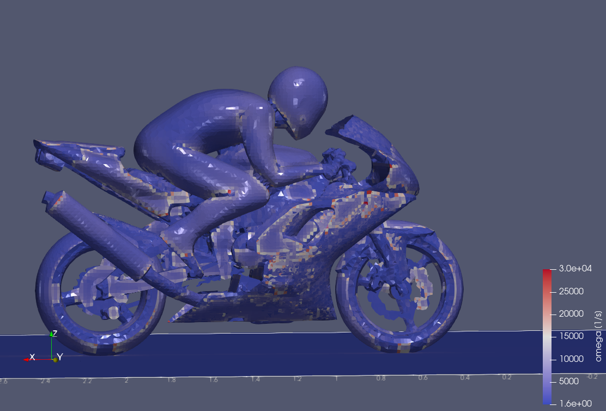
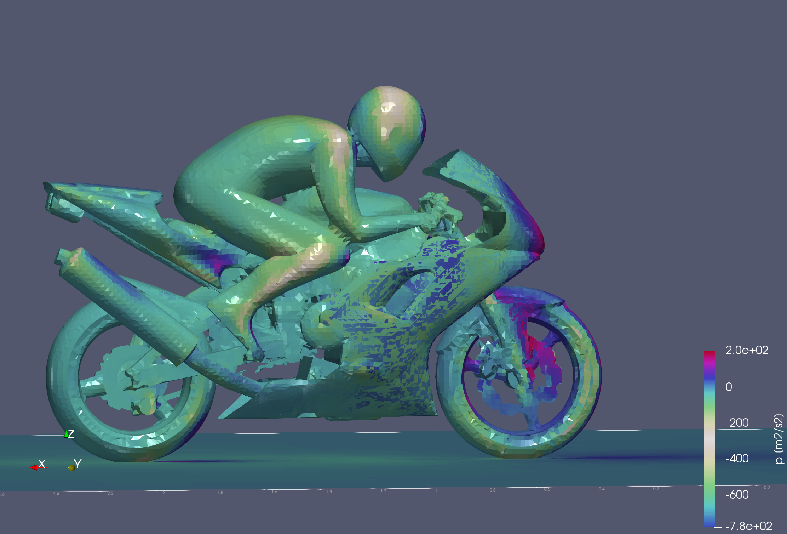
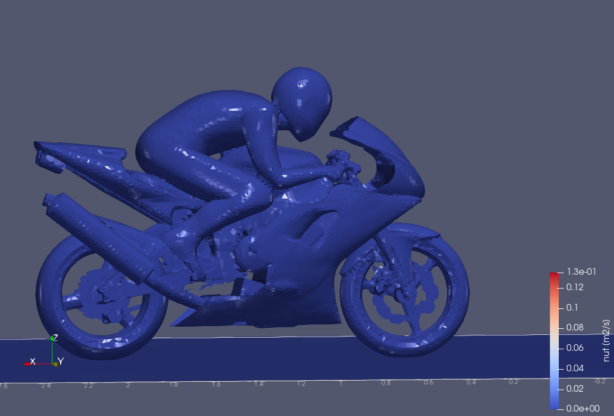
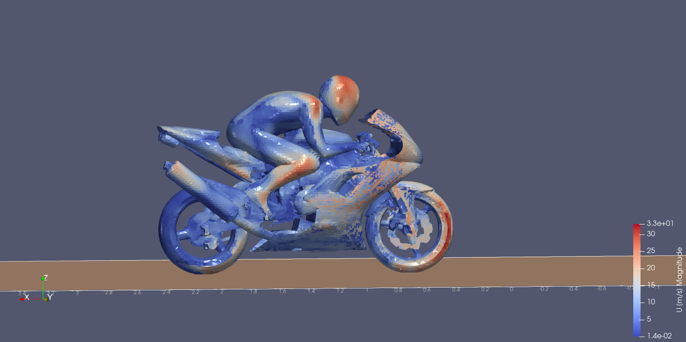
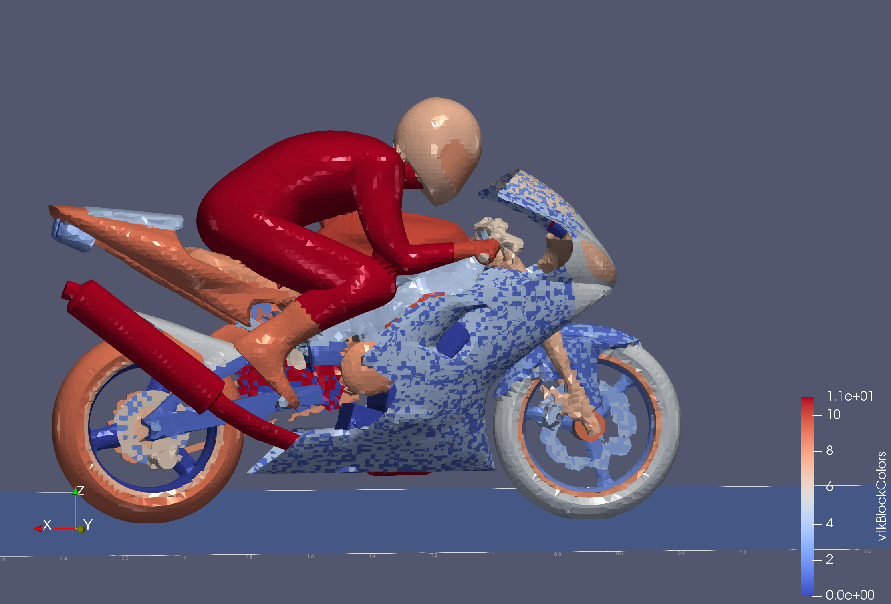

# MotorBike CFD Simulation in OpenFOAM: End-to-End Guide

This document provides a comprehensive guide—from installation and case setup to simulation and visualization—using the OpenFOAM motorBike tutorial. It also explains the physical meaning and mathematical background of key CFD fields with accompanying images.

## 1. Installation of OpenFOAM & ParaView

### For Ubuntu (Example: OpenFOAM 2406)

1. **Install OpenFOAM and ParaView:**

   ```bash
   sudo apt update
   sudo apt install openfoam paraview
   ```

2. **Set up the environment:**
   Add the following line to your `~/.bashrc`:
   ```bash
   echo "source /usr/lib/openfoam/openfoam2406/etc/bashrc" >> ~/.bashrc
   source ~/.bashrc
   ```
3. **Verify the installation:**
   ```bash
   foamInstallationTest
   ```

---

## 2. Setting Up the MotorBike Case

### Copy the Tutorial Case

1. **Create your run directory and copy the case:**
   ```bash
   mkdir -p $FOAM_RUN
   cd $FOAM_RUN
   cp -r $FOAM_TUTORIALS/incompressible/simpleFoam/motorBike .
   cd motorBike
   ```
2. **Unzip the geometry file:**
   ```bash
   gunzip constant/triSurface/motorBike.obj.gz
   ```
   This produces the file:
   ```
   constant/triSurface/motorBike.obj
   ```

---

## 3. Pre-Processing & Meshing

### Surface Feature Extraction

Extract features from the geometry:

```bash
surfaceFeatureExtract
```

### Base Mesh Generation (blockMesh)

Create the background mesh:

```bash
blockMesh
```

### Mesh Refinement (snappyHexMesh)

Refine the mesh to conform to the bike's surface:

```bash
snappyHexMesh -overwrite
```

Check mesh quality:

```bash
checkMesh
```

View the mesh:

```bash
paraFoam
```

_Note: Initially, you may see a rectangular domain (bounding box) with the bike embedded inside._

---

## 4. Preparing Initial Conditions

The initial fields are stored in the `0.orig` folder. **Do not rename this folder; instead, copy its contents into a new `0` folder:**

```bash
cp -r 0.orig/* 0/
```

This ensures files like `p`, `U`, `nut`, `k`, and `omega` are available for the solver.

---

## 5. Running the Simulation with simpleFoam

Run the steady-state solver using the SIMPLE algorithm:

```bash
simpleFoam > log.simpleFoam
```

### CFD & Mathematical Background

**Computational Fluid Dynamics (CFD)** uses numerical methods (like the finite volume method) to solve the Navier–Stokes equations. In our simulation, the key equations are:

- **Continuity Equation (Mass Conservation):**
  \[
  \nabla \cdot \mathbf{U} = 0
  \]
- **Momentum Equation:**
  \[
  \rho (\mathbf{U}\cdot \nabla \mathbf{U}) = -\nabla p + \nabla \cdot \left[(\mu + \mu_t)\nabla \mathbf{U}\right]
  \]
  where \(\mu_t\) is the turbulent (eddy) viscosity.

- **Turbulence Modeling (k-ω Model):**
  Additional transport equations are solved for turbulent kinetic energy \(k\) and the specific dissipation rate \(\omega\). The turbulent viscosity is computed as:
  \[
  \nu_t = \frac{k}{\omega}
  \]

**How OpenFOAM (simpleFoam) Works:**

- **Discretization:** The solver divides the computational domain into small control volumes (cells) using the finite volume method.
- **SIMPLE Algorithm:** For steady-state incompressible flows, simpleFoam iteratively solves the discretized equations to obtain fields such as velocity (\( \mathbf{U} \)), pressure (\( p \)), turbulent viscosity (\( \nu_t \) or `nut`), and the specific dissipation rate (\( \omega \)).
- **Output:** The results are stored in time directories, even if the simulation is steady-state.

---

## 6. Visualization in ParaView

Launch ParaView:

```bash
paraFoam
```

### Basic Steps:

1. Load `motorBike.foam` and click **Apply**.
2. Change the representation to **Surface** for a smooth look.
3. In the **Coloring** dropdown, select a field (e.g., `U`, `p`, `nut`, or `omega`).
4. Use the camera and mouse controls to adjust the view.

### Advanced Visualization: Stream Tracers

- Apply the **Stream Tracer** filter to visualize flow paths.
- Set a suitable seed source (point or line) to show passing streamlines.
- Adjust the maximum streamline length and resolution, then click **Apply**.

---

## 7. Exported Images & Their Interpretations

Below are five images exported from ParaView, with explanations and the underlying CFD context:

### a) Omega Field (`omega.png`)



- **What It Shows:**  
  The image visualizes the specific dissipation rate, \(\omega\), which indicates how rapidly turbulent kinetic energy is being dissipated.
- **Interpretation:**  
  High \(\omega\) values (warm colors) are typically seen in regions with intense shear or near sharp edges, whereas low values (cool colors) indicate slower dissipation.
- **Mathematical Context:**  
  \(\omega\) is part of the turbulence model equations and directly influences the computation of turbulent viscosity.

### b) Pressure Field (`pressure.png`)



- **What It Shows:**  
  This image displays the pressure distribution around the motorbike.
- **Interpretation:**  
  High-pressure zones (warm colors) often occur at stagnation points (e.g., the front of the bike), while low-pressure zones (cool colors) are present in the wake regions behind the bike.
- **Relevance:**  
  Pressure differences drive aerodynamic forces like drag and lift.

### c) Turbulence Viscosity (`turbulance_viscosity.png`)



- **What It Shows:**  
  The turbulent viscosity (\(\nu_t\) or `nut` in OpenFOAM) field, which quantifies the enhanced momentum transfer due to turbulence.
- **Interpretation:**  
  Higher turbulent viscosity indicates regions of intense turbulence, which affect flow separation and mixing.
- **Mathematical Context:**  
  \(\nu_t\) is computed as \(\frac{k}{\omega}\), where \(k\) is the turbulent kinetic energy.

### d) Velocity Field (`velocity.png`)



- **What It Shows:**  
  The velocity field, usually represented as the magnitude \(|\mathbf{U}|\) of the velocity vector.
- **Interpretation:**  
  Warm colors (yellow/red) indicate areas where the airflow is accelerated (e.g., around streamlined surfaces), while cool colors (blue) mark regions of recirculation or separation (e.g., in the wake).
- **Mathematical Context:**  
  Velocity magnitude is given by:
  \[
  |\mathbf{U}| = \sqrt{U_x^2 + U_y^2 + U_z^2}
  \]

### e) VTK Block Colors (`vtk_block_clr.png`)



- **What It Shows:**  
  This image illustrates the block coloring applied by VTK, which distinguishes different mesh blocks or partitions.
- **Interpretation:**  
  Each color represents a different mesh block, useful for verifying mesh partitioning and ensuring proper refinement.
- **Note:**  
  This visualization is primarily for quality control and does not represent a physical variable.

---

## 8. Exporting Images

To export images from ParaView:

1. Adjust the view (camera, lighting, and representation).
2. Select **File → Save Screenshot...**
3. Choose a high resolution (e.g., 1920×1080 or higher) and your desired file format (PNG, SVG, etc.).
4. Save each image with a clear filename (e.g., `omega.png`, `pressure.png`, etc.).

---

## 9. Cleanup and Restart (Optional)

If you need to clean previous results and restart:

```bash
rm -rf 0 log.* processor* constant/polyMesh
blockMesh
surfaceFeatureExtract
snappyHexMesh -overwrite
cp -r 0.orig/* 0/
simpleFoam > log.simpleFoam
```

---
