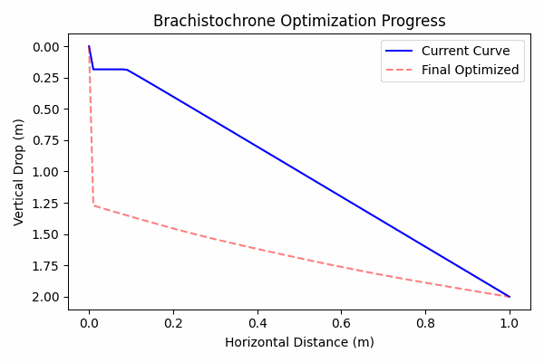
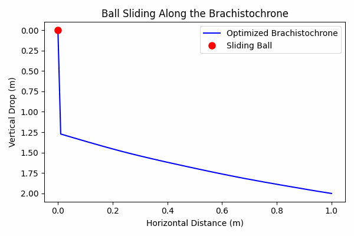

# Brachistochrone Visualization

This project demonstrates a numerical solution to the brachistochrone problem and provides two dynamic visualizations:

1. **Optimization Progress GIF:**  
   An animation that shows how the brachistochrone curve evolves during the optimization process.

2. **Ball Sliding Animation GIF:**  
   A simulation where a ball slides along the final optimized brachistochrone curve, illustrating the time-optimal path under gravity.

---

## Background

The **brachistochrone problem** is a famous problem in the calculus of variations. It asks:  
_"What is the curve along which a bead will slide (under the influence of gravity) between two points in the least time?"_

Surprisingly, the optimal solution to this problem is a **cycloid**. This problem has historical significance and provides insight into both physics and optimization methods.

### Mathematical Formulation

The travel time \( T \) along a curve \( y(x) \) under gravity is given by:

\[
T = \int \frac{\sqrt{1 + \left(\frac{dy}{dx}\right)^2}}{\sqrt{2gy}} \, dx
\]

where:

- \( g \) is the gravitational acceleration (9.81 m/s²),
- \( \frac{dy}{dx} \) is the slope of the curve,
- \( y \) represents the vertical position (with \( y \) increasing downward).

In this project, the horizontal distance is discretized into \( N \) segments and the integral is approximated using a trapezoidal rule. The interior points of the curve (with fixed endpoints) are then optimized to minimize the total travel time.

---

## Installation

Ensure you have Python 3 installed along with the following required packages:

- `numpy`
- `matplotlib`
- `scipy`
- `imageio`

You can install these dependencies using pip:

```bash
pip install numpy matplotlib scipy imageio
```

---

## Usage

1. Clone or download the project repository.
2. Navigate to the project directory.
3. Run the main script:

   ```bash
   python brachistochrone.py
   ```

This will generate two GIF files in the project folder:

- **`optimization_progress.gif`** – showing the evolution of the brachistochrone curve during the optimization process.
- **`ball_sliding_brachistochrone.gif`** – demonstrating a ball sliding along the optimized curve.

---

## Visualizations

### 1. Optimization Progress GIF

This animation captures the iterative process of optimizing the brachistochrone curve. Each frame of the GIF displays:

- The current state of the curve (in blue).
- The final optimized curve (in red, dashed for reference).

The animation helps visualize how the curve gradually approaches the time-optimal solution.



### 2. Ball Sliding Animation GIF

After the optimal curve is determined, the next visualization simulates the motion of a ball sliding along this curve under gravity. Key points include:

- **Time Integration:** The cumulative travel time along the curve is computed to map the ball’s position.
- **Interpolation:** Linear interpolation is used to determine the ball’s \( (x, y) \) position at any given time.
- **Animation:** A red marker (the ball) moves along the blue curve representing the brachistochrone path.

This dynamic animation provides a clear, intuitive representation of how an object would travel along the optimal path in the least time.



---

## Code Structure & Mathematical Details

### Problem Setup

- **Discretization:**
  The horizontal distance \( L \) is divided into \( N \) points with a spacing \( \Delta x \), and the vertical positions are initialized using a linear interpolation from a small starting value (to avoid division by zero) to the drop height \( H \).

### Total Time Functional

- **Travel Time Integral:**
  The total travel time is approximated using the expression:

  \[
  T \approx \sum*{i=0}^{N-2} \frac{\sqrt{1 + \left(\frac{y*{i+1} - y*i}{\Delta x}\right)^2}}{\sqrt{2g \cdot y*{\text{mid}}}} \Delta x
  \]

  where \( y\_{\text{mid}} \) is the average of consecutive \( y \)-values.

### Optimization

- **Method:**
  The interior \( y \)-values are optimized using the Sequential Least Squares Programming (SLSQP) method. Constraints ensure the curve remains monotonic (non-decreasing) and respects the boundary conditions.
- **Intermediate States:**
  During optimization, intermediate solutions are stored and later used to create the **Optimization Progress GIF**.

### Ball Sliding Simulation

- **Cumulative Time Calculation:**
  After obtaining the optimized curve, cumulative travel times are calculated segment-by-segment.
- **Interpolation:**
  Interpolation functions map the time to the corresponding \( (x, y) \) position on the curve.

- **Animation:**
  The ball’s movement is animated across frames, showing its traversal along the optimal path.

---

## Conclusion

This project not only computes the time-optimal brachistochrone curve using numerical optimization but also provides two engaging visualizations:

- An animation of the optimization process.
- A simulation of a ball sliding along the optimal curve.

These visualizations help bridge the gap between abstract mathematical optimization and real-world physical dynamics, offering both educational and visual appeal.

---

## License

This project is licensed under the MIT License.
