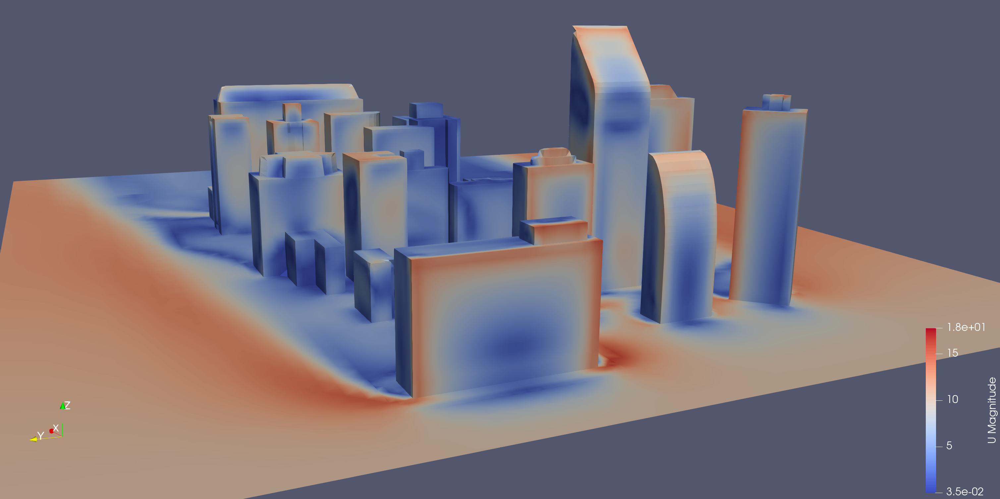
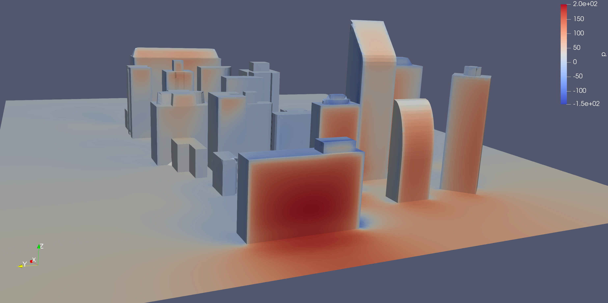
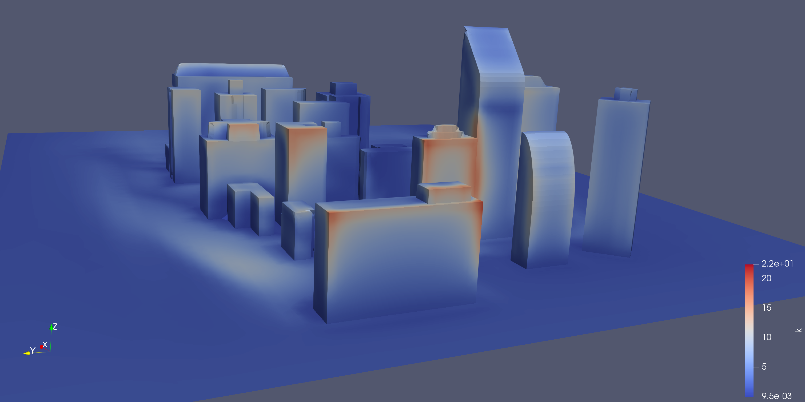

# Wind Around Buildings Simulation in OpenFOAM

This README explains how to set up and run the **windAroundBuildings** case using OpenFOAM. It covers:

- Copying the tutorial and geometry files
- Preparing the case (including renaming directories)
- Mesh generation and simulation commands
- An explanation of key field variables: **U**, **p**, **k**, **epsilon**, and **nut**
- Example result images for visualization

---

## Background

Wind flow simulations around buildings are crucial for evaluating aerodynamic performance, assessing pedestrian comfort, and studying pollutant dispersion. The simulation workflow includes:

- **Geometry Preparation:** Importing building geometry (e.g., an OBJ file) into the case.
- **Mesh Generation:** Creating a background mesh and refining it to capture the building features.
- **Solver Execution:** Running a CFD solver (steady or transient) to solve the flow field.
- **Post-Processing:** Visualizing key fields such as velocity, pressure, and turbulence quantities.

Below are example images from a typical simulation run:





---

## 1. Copying Files

### 1.1 Copy Tutorial Case Files

Copy the tutorial case files from the OpenFOAM installation directory to your local working directory. For example:

```bash
mkdir -p ~/OpenFOAM/windAroundBuildings
cp -r /usr/lib/openfoam/openfoam2406/tutorials/incompressible/simpleFoam/windAroundBuildings/* ~/OpenFOAM/windAroundBuildings
```

### 1.2 Copy Geometry Files

The building geometry files (e.g., `building.obj`) are stored in the resources folder. Copy these files to the case’s surface folder (typically `constant/triSurface`):

```bash
mkdir -p ~/OpenFOAM/windAroundBuildings/constant/triSurface
cp /usr/lib/openfoam/openfoam2406/tutorials/resources/geometry/building.obj ~/OpenFOAM/windAroundBuildings/constant/triSurface/
```

---

## 2. Preparing the Case

### 2.1 Rename the Initial Condition Folder

If your case contains a folder named `0.orig` (with initial condition files), rename it to `0` so that OpenFOAM can locate the files correctly:

```bash
cd ~/OpenFOAM/windAroundBuildings
mv 0.orig 0
```

---

## 3. Mesh Generation and Simulation

### 3.1 Mesh Generation Steps

Run the following commands from the case directory:

1. **Generate the Background Mesh**

   ```bash
   blockMesh
   ```

2. **Extract Sharp Features**
   (Only needed if your geometry requires feature edge extraction)

   ```bash
   surfaceFeatureExtract
   ```

3. **Refine the Mesh with snappyHexMesh**
   This command snaps the background mesh to your building geometry and refines cells around the surface.

   ```bash
   snappyHexMesh -overwrite
   ```

4. **Check Mesh Quality**

   ```bash
   checkMesh
   ```

### 3.2 Running the Simulation

You can run either a steady-state or transient simulation.

- **Steady-State Simulation:**
  Run the case using the default steady solver:

  ```bash
  simpleFoam
  ```

- **Transient Simulation with pimpleFoam:**
  Update your `controlDict` to use `pimpleFoam` (see the sample below) and then run:

  ```bash
  pimpleFoam
  ```

#### Sample Updated `controlDict` for pimpleFoam

```cpp
/*--------------------------------*- C++ -*----------------------------------*\
| =========                 |                                                 |
| \\      /  F ield         | OpenFOAM: The Open Source CFD Toolbox           |
|  \\    /   O peration     | Version:  v2406                                 |
|   \\  /    A nd           | Website:  www.openfoam.com                      |
|    \\/     M anipulation  |                                                 |
\*---------------------------------------------------------------------------*/
FoamFile
{
    version     2.0;
    format      ascii;
    class       dictionary;
    object      controlDict;
}

application     pimpleFoam;

startFrom       startTime;
startTime       0;
stopAt          endTime;
endTime         400;
deltaT          1;

writeControl    timeStep;
writeInterval   50;
purgeWrite      0;
writeFormat     binary;
writePrecision  6;
writeCompression off;
timeFormat      general;
timePrecision   6;

runTimeModifiable true;

functions
{
    #include "ensightWrite"
    #include "vtkWrite"
    #include "visualization"
    #include "profiling"
}

// ************************************************************************* //
```

---

## 4. Explanation of Key Field Variables

### U (Velocity Field)

- **Purpose:** Stores the wind velocity vector at every cell.
- **Location:** Defined in the `0/U` file.
- **Role in Simulation:** Provides the initial wind speed and direction; updated during the simulation according to the momentum equations.

### p (Pressure Field)

- **Purpose:** Represents the pressure distribution throughout the domain.
- **Location:** Defined in the `0/p` file.
- **Role in Simulation:** Ensures mass conservation and drives the flow, with boundary conditions specified in the file.

### k (Turbulent Kinetic Energy)

- **Purpose:** Quantifies the energy contained in turbulent eddies.
- **Location:** Typically defined in the initial conditions (e.g., `0/k`) when using turbulence models such as k-epsilon.
- **Role in Simulation:** Helps determine the turbulence intensity in the flow.

### epsilon (Turbulent Dissipation Rate)

- **Purpose:** Measures the rate at which turbulent kinetic energy is dissipated.
- **Location:** Often defined in `0/epsilon` for turbulence modeling.
- **Role in Simulation:** Works with **k** to describe turbulence decay and scales.

### nut (Turbulent Viscosity)

- **Purpose:** Represents the eddy viscosity, which enhances momentum diffusion due to turbulence.
- **Location:** Computed during the simulation and stored in the appropriate field.
- **Role in Simulation:** Modifies the effective viscosity in the momentum equations to account for turbulent mixing.

---

## 5. Post-Processing

After running your simulation, visualize the results using ParaView:

```bash
paraFoam
```

This will allow you to inspect the velocity, pressure, and turbulence fields, similar to the attached example images above.

---

## Conclusion

This guide provides an end-to-end workflow for setting up and running the **windAroundBuildings** case in OpenFOAM. The steps include:

1. Copying the necessary tutorial and geometry files.
2. Preparing the case by renaming directories (e.g., renaming `0.orig` to `0`).
3. Generating the mesh using `blockMesh`, `surfaceFeatureExtract`, and `snappyHexMesh`.
4. Running the simulation with either `simpleFoam` for steady-state or `pimpleFoam` for transient analysis.
5. Understanding key field variables: **U**, **p**, **k**, **epsilon**, and **nut**.
6. Visualizing the results with provided example images.

Feel free to adjust file paths, solver settings, and other parameters according to your simulation requirements.

```

---

This README should now serve as a comprehensive guide for your simulation setup, including embedded images for visual reference.
```
