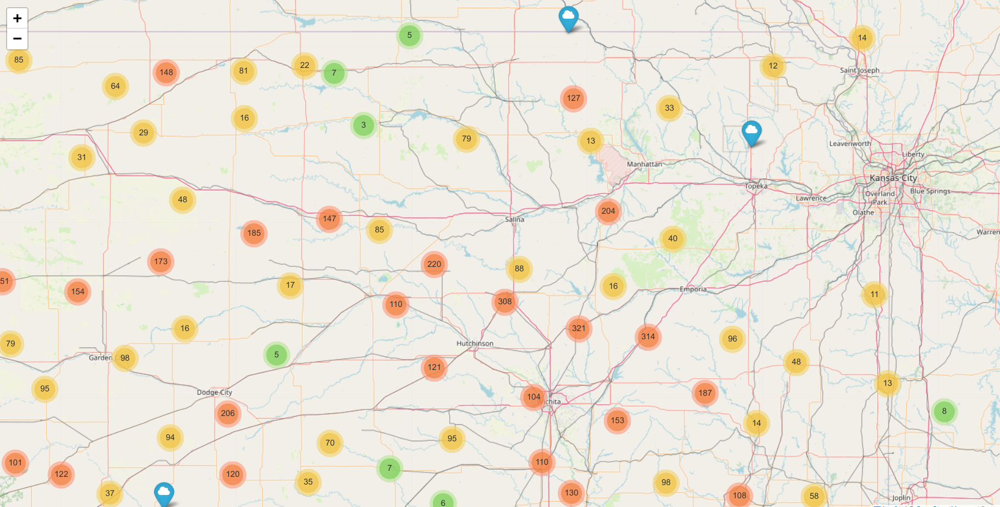
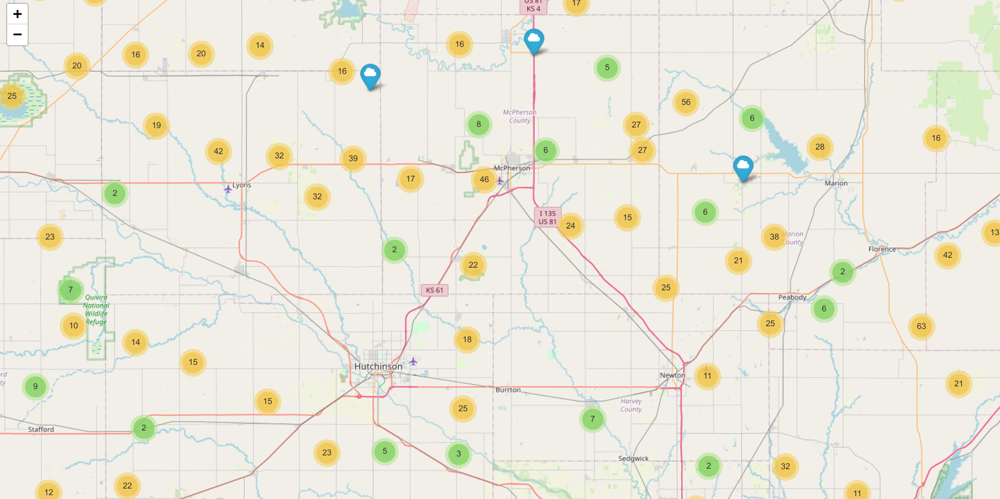

# Hail Events Map for Kansas City

This repository contains a Python script that fetches severe hail event data from NOAA’s Severe Weather Data Inventory (SWDI) API and visualizes it on an interactive map using Folium. The map is designed to display hail events around Kansas City for a specified date range using custom icons and marker clustering to keep the presentation clean.

## Features

- **Data Fetching:** Retrieves hail event data from NOAA’s SWDI API.
- **Data Filtering:** Limits results using a bounding box around Kansas City.
- **Interactive Map:** Uses [Folium](https://python-visualization.github.io/folium/) to create an interactive HTML map.
- **Marker Clustering:** Groups nearby markers to reduce clutter.
- **Custom Icons:** Uses Font Awesome icons (a blue cloud) to represent hail events.

## Requirements

- Python 3.11
- [virtualenv](https://docs.python.org/3/library/venv.html) (or any preferred virtual environment tool)

## Setup Instructions

1. **Clone the Repository:**

   ```bash
   git clone https://github.com/your-username/your-repo.git
   cd your-repo
   ```

2. **Create and Activate a Virtual Environment:**

   ```bash
   python3.11 -m venv env
   source env/bin/activate   # On Windows: env\Scripts\activate
   ```

3. **Install Dependencies:**

   This project requires the following Python packages:

   - `requests`
   - `folium`

   Install them using the provided `requirements.txt` file:

   ```bash
   pip install -r requirements.txt
   ```

   _If a `requirements.txt` file is not present, you can manually install dependencies:_

   ```bash
   pip install requests folium
   ```

## Usage

1. **Configure the Script (Optional):**
   The script is pre-configured to query hail events for the date range **June 1–8, 2024** within the Kansas City bounding box (`-95,38.8,-94.4,39.2`). If you need to change these parameters, update the API URL in the script accordingly.

2. **Run the Script:**

   ```bash
   python hail_events_map_kansas_city.py
   ```

   Running the script will generate an HTML file named `hail_events_map_kansas_city.html` in the project directory.

3. **View the Map:**
   Open the generated HTML file in your web browser to interact with the map:

   ```bash
   open hail_events_map_kansas_city.html   # macOS
   # or double-click the file on Windows
   ```

## Demonstration

Below is a placeholder for a GIF demonstrating the map in action:




## Project Structure

```
your-repo/
├── env/                        # Virtual environment folder (optional, not tracked in git)
├── hail_events_map_kansas_city.py  # Main Python script
├── requirements.txt            # List of required Python packages
└── README.md                   # This file
```

## License

This project is licensed under the MIT License. See the [LICENSE](LICENSE) file for details.

## Acknowledgments

- **NOAA SWDI:** Data provided by NOAA’s Severe Weather Data Inventory.
- **Folium:** Interactive map visualization powered by [Folium](https://python-visualization.github.io/folium/).

---

Feel free to contribute, open issues, or suggest improvements!
