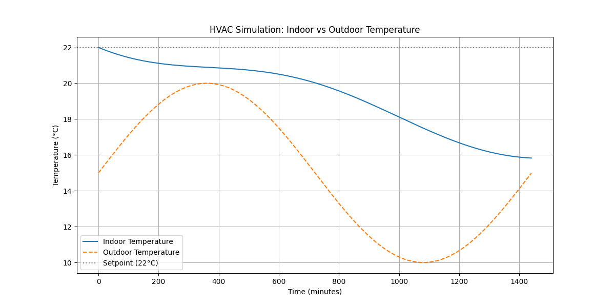

# HVAC Simulation and Optimization

This project demonstrates a simple HVAC simulation using OpenModelica and Python. The model captures the thermal dynamics of a building's indoor environment in response to a naturally varying outdoor temperature. By studying this system, we gain insight into how buildings respond to external temperature fluctuations and how active control (optimization) could improve energy efficiency and occupant comfort.



## Table of Contents

- [Introduction](#introduction)
- [Why This Project?](#why-this-project)
- [Applications](#applications)
- [Installation](#installation)
- [Project Overview](#project-overview)
- [Detailed Model Description](#detailed-model-description)
  - [Model Parameters](#model-parameters)
  - [Model Variables](#model-variables)
  - [Governing Equations](#governing-equations)
  - [Underlying Math and Physics](#underlying-math-and-physics)
- [Simulation Code Explanation](#simulation-code-explanation)
- [Visualization and Graph Explanation](#visualization-and-graph-explanation)
- [Extending to Optimization](#extending-to-optimization)
- [Running the Simulation](#running-the-simulation)

## Introduction

This project models an HVAC (Heating, Ventilation, and Air Conditioning) system in a building to analyze indoor temperature dynamics. The simulation uses a simple energy balance model, where the indoor temperature is affected by both a sinusoidally varying outdoor temperature and the HVAC system's power input. Although the current implementation operates in an open-loop mode (no active HVAC control), it establishes the foundation for future optimization studies.

## Why This Project?

Buildings account for a significant portion of global energy consumption. Efficient HVAC control not only improves comfort but also contributes to energy savings and reduced environmental impact. This project is designed to:

- **Understand Thermal Dynamics:**  
  Learn how a building's indoor temperature responds to external temperature fluctuations.
- **Develop Control Strategies:**  
  Establish a baseline model that can be extended with optimization techniques (e.g., feedback controllers or machine learning) to maintain comfortable indoor conditions while reducing energy usage.
- **Educational Value:**  
  Provide a hands-on example for students, researchers, and practitioners interested in building simulation, control engineering, and energy management.

## Applications

The concepts and tools demonstrated in this project have broad applications:

- **Building Energy Management:**  
  Optimize HVAC operations in residential, commercial, and industrial buildings.
- **Smart Grids and Demand Response:**  
  Integrate HVAC control strategies with smart grid technologies to balance energy demand.
- **Sustainability Research:**  
  Explore methods for reducing the carbon footprint of buildings.
- **Educational Tools:**  
  Serve as a learning platform for courses in building physics, control systems, and energy efficiency.

## Installation

Before running the simulation, ensure you have the following installed:

1. **Python 3.x**  
   Download and install from [python.org](https://www.python.org/).

2. **OpenModelica**  
   Download and install OpenModelica from the [official website](https://openmodelica.org/download).  
   Make sure the `omc` executable is added to your system's PATH.

3. **OMPython**  
   The Python interface for OpenModelica, available via pip:

   ```bash
   pip install OMPython
   ```

4. **Additional Python Packages**  
   Install the required packages using pip:
   ```bash
   pip install matplotlib pandas scipy
   ```

## Project Overview

This project includes two major components:

- **The Modelica Model (`HVACModel.mo`):**  
  Defines the thermal dynamics of the indoor environment influenced by outdoor temperature variations.
- **The Python Script (`hvac_simulation.py`):**  
  Automates the process of writing the Modelica code, simulating the model using OpenModelica via OMPython, reading the simulation results, and visualizing the data.

## Detailed Model Description

### The Model

The HVAC model is defined in Modelica as follows:

```modelica
model HVACModel
  "A simple HVAC model with a dynamic indoor temperature and sinusoidal outdoor temperature."

  // Parameters for the HVAC system and building
  parameter Real T_set = 22 "Desired indoor temperature (°C)";
  parameter Real U = 0.5 "Heat transfer coefficient";
  parameter Real C = 500 "Thermal capacity";
  parameter Real Q = 0 "HVAC input power (W) - set to 0 for open-loop simulation";

  // Variables
  Real T(start=T_set) "Indoor temperature (°C)";
  Real T_out "Outdoor temperature (°C)";

equation
  // Define outdoor temperature as a sinusoidal function of time (time in minutes)
  T_out = 15 + 5*sin(2*3.14*time/1440);

  // Thermal dynamics: rate of change of indoor temperature
  der(T) = (Q + U*(T_out - T)) / C;
end HVACModel;
```

### Model Parameters

- **T_set (22 °C):**  
  Sets the desired indoor temperature and initial value of the indoor temperature.

- **U (0.5):**  
  The heat transfer coefficient controls the rate at which heat is exchanged between indoors and outdoors. A higher value leads to quicker heat transfer.

- **C (500):**  
  Represents the thermal capacity of the building. This parameter dictates how much energy is needed to change the indoor temperature. A larger capacity means that temperature changes are more gradual.

- **Q (0):**  
  The HVAC system’s power input. In this open-loop simulation, Q is set to 0, implying no active heating or cooling. In an optimized system, Q would be dynamically adjusted to control the indoor temperature.

### Model Variables

- **T (Indoor Temperature):**  
  The indoor temperature, which evolves over time based on the thermal dynamics of the building.

- **T_out (Outdoor Temperature):**  
  The outdoor temperature is defined as a sinusoidal function, mimicking the natural daily cycle.

### Governing Equations

1. **Outdoor Temperature Equation:**

   ```modelica
   T_out = 15 + 5*sin(2*3.14*time/1440);
   ```

   - **Explanation:**  
     Models the outdoor temperature as a sine wave:
     - **Mean Temperature:** 15 °C.
     - **Amplitude:** 5 °C (oscillates between 10 °C and 20 °C).
     - **Period:** 1440 minutes (24 hours), reflecting a daily cycle.

2. **Indoor Temperature Dynamics:**
   ```modelica
   der(T) = (Q + U*(T_out - T)) / C;
   ```
   - **Explanation:**  
     Governs the change in indoor temperature over time:
     - **\(Q\):** Represents HVAC heating or cooling (currently 0).
     - **\(U \cdot (T\_{out} - T)\):** Describes the heat exchange between indoors and outdoors.
     - **\(C\):** Dampens the temperature change by representing the building's thermal capacity.
   - **Physical Insight:**  
     The equation is derived from an energy balance, considering both the HVAC influence and passive heat transfer with the environment. It is a first-order differential equation solved numerically by OpenModelica.

## Simulation Code Explanation

The Python script (`hvac_simulation.py`) executes the following steps:

1. **Write the Modelica Model:**

   - The script creates a file (`HVACModel.mo`) containing the Modelica code shown above.

2. **Load and Simulate Using OMPython:**

   - An OpenModelica session is started via `OMCSessionZMQ`.
   - The model file is loaded and checked for errors.
   - The model is instantiated and simulated over 1440 minutes with 1-minute intervals.
   - Simulation results are saved in CSV format.

3. **Read Simulation Results:**

   - The result file path is extracted from the simulation output.
   - Pandas reads the CSV file, converting the simulation data into a DataFrame.

4. **Visualization:**
   - Matplotlib generates a plot that displays:
     - **Indoor Temperature (T):** The simulated indoor temperature profile.
     - **Outdoor Temperature (T_out):** The sinusoidal outdoor temperature profile.
     - **Setpoint (22 °C):** A horizontal line indicating the desired temperature.

## Visualization and Graph Explanation

The generated graph shows:

- **Outdoor Temperature (T_out):**  
  A sinusoidal curve that oscillates between approximately 10 °C and 20 °C over a 24-hour period, representing the natural day-night temperature cycle.
- **Indoor Temperature (T):**  
  A smoother curve starting at 22 °C (the setpoint), which evolves according to the energy balance equation. Due to the thermal capacity, the indoor temperature changes more slowly than the outdoor temperature.
- **Setpoint Line (22 °C):**  
  A reference line indicating the desired indoor temperature. In an optimized system, control strategies would adjust \(Q\) to keep the indoor temperature near this value.

## Extending to Optimization

Currently, the model operates in an open-loop mode (with \(Q = 0\)). To improve energy efficiency and comfort, one can extend this project by:

- **Dynamic HVAC Control:**  
  Implement a controller (e.g., PID, reinforcement learning) that dynamically adjusts \(Q\) based on the error \(T - T\_{set}\).

- **Optimization Objective:**  
  The goal is to minimize the deviation from the desired indoor temperature while reducing energy consumption.

- **Advanced Applications:**  
  Extend the model to include additional factors such as humidity, solar radiation, or multi-zone dynamics, and integrate these with smart building management systems.

## Running the Simulation

1. **Install all required software and packages** as described in the [Installation](#installation) section.
2. **Save the provided Python code** as `hvac_simulation.py`.
3. **Execute the script:**
   ```bash
   python hvac_simulation.py
   ```
4. **View the output plot:**  
   The graph will display the indoor and outdoor temperature profiles over a 24-hour period along with the setpoint line.

---
