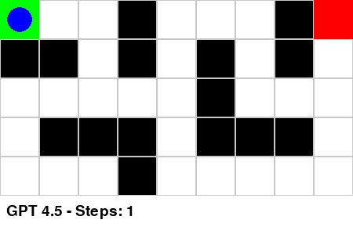
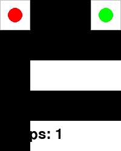
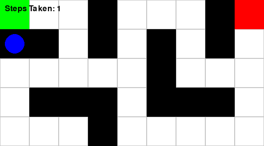

# Maze Solver Visualizer

This project demonstrates how to leverage a language model (LLM) to generate a Python program that solves a text-based maze and visualizes the solution using Pygame. The project includes:

- Parsing a maze from a text representation.
- Solving the maze using a manually determined solution path.
- Visualizing the maze and the path taken from the start (`S`) to the exit (`E`) with smooth animation.
- Generating a GIF of the animation.

Additionally, outputs generated by three different models are embedded below.

---

## Table of Contents

- [Installation](#installation)
- [Usage](#usage)
- [Prompt Details](#prompt-details)
- [Code (GPT4.5 Version)](#code-gpt45-version)
- [Output Visualizations](#output-visualizations)
- [Project Structure](#project-structure)

---

## Installation

Ensure you have Python 3.6 or later installed. Then, install the required dependencies:

```bash
pip install pygame imageio
```

No additional setup is needed. The project is self-contained and ready to run once the dependencies are installed.

---

## Usage

1. **Clone the repository or download the project files.**
2. **Run the script** (e.g., `python gpt4_5.py`). The program will:

   - Parse the text-based maze.
   - Animate the movement from the start to the exit.
   - Display the number of steps taken.
   - Save the animation as a GIF (e.g., `maze_output_gpt4-5.gif`).

3. **View the generated GIF animation** to see the visualized solution.

---

## Prompt Details

The following prompt was given to the LLM to generate the solution:

> **Task Overview:**
>
> **Input:** A text-based maze.
>
> **Output:** A Python program using Pygame that:
>
> - Visualizes the maze.
> - Animates the movement from the start ('S') to the exit ('E') along the path determined by logical reasoning.
> - Displays the number of steps taken.
>
> ---
>
> **Maze Description:**
>
> You are provided with the following text-based maze representation:
>
> ```python
> maze_text = '''
> +---+---+---+---+---+---+---+---+---+
> | S |   |   | # |   |   |   | # | E |
> +---+---+---+---+---+---+---+---+---+
> | # | # |   | # |   | # |   | # |   |
> +---+---+---+---+---+---+---+---+---+
> |   |   |   |   |   | # |   |   |   |
> +---+---+---+---+---+---+---+---+---+
> |   | # | # | # |   | # | # | # |   |
> +---+---+---+---+---+---+---+---+---+
> |   |   |   | # |   |   |   |   |   |
> +---+---+---+---+---+---+---+---+---+
> '''
> ```
>
> **Legend:**
>
> - `'S'`: Start position.
> - `'E'`: Exit position.
> - `'#'`: Wall (impassable).
> - Spaces: Open path (passable).
>
> ---
>
> **Detailed Instructions:**
>
> 1. **Parse the Maze:**
>
>    - Write code to parse the `maze_text` and convert it into a suitable data structure (e.g., a 2D list or array) representing the maze grid.
>    - Identify the coordinates of the start (`'S'`) and exit (`'E'`) positions.
>
> 2. **Solve the Maze:**
>
>    - Using logical reasoning, determine the path from `'S'` to `'E'`.
>      - Think through the maze step by step.
>      - Make decisions at each point based on the available paths.
>      - Avoid walls (`'#'`) and do not go out of bounds.
>    - Document the sequence of moves (up, down, left, right) you take to reach the exit.
>    - Record the steps taken to form the solution path.
>
> 3. **Create Pygame Visualization:**
>
>    - Initialize a Pygame window that visually represents the maze.
>    - Use different colors or sprites to represent:
>      - Walls.
>      - Open paths.
>      - Start and exit points.
>      - The moving character or marker.
>
> 4. **Animate the Solution Path:**
>
>    - Animate the character's movement from the start to the exit along the path you determined.
>    - The animation should display the character moving step by step through the maze.
>    - Ensure the movement speed allows observers to follow the character's progress.
>
> 5. **Display Steps Taken:**
>
>    - Overlay the Pygame window with a real-time display of the number of steps taken.
>    - Update the step count as the character moves through the maze.
>    - Once the exit is reached, display the total number of steps taken.
>
> 6. **Provide the Complete Code:**
>    - Output the full Python code, including all necessary imports and functions.
>    - Ensure the code is well-commented to explain each part of the program.
>    - The code should be ready to run without modifications (assuming Pygame is installed).
>
> ---
>
> **Evaluation Criteria:**
>
> - **Correctness:**
>
>   - The maze is correctly parsed and represented in code.
>   - The path you provide correctly leads from `'S'` to `'E'`.
>   - The character successfully reaches the exit following your path.
>
> - **Code Quality:**
>
>   - The code is well-structured and readable.
>   - Proper use of functions and modularity.
>   - Comments and documentation are provided.
>
> - **Visualization Quality:**
>   - The maze is visually clear and accurately represents walls and paths.
>   - The movement animation is smooth.
>   - The step count display is clear and updates correctly.
>
> ---
>
> **Additional Notes:**
>
> - **Assumptions:**
>
>   - Pygame is installed and available in the execution environment.
>   - The code will be run in a standard Python 3 environment.
>
> - **Considerations:**
>   - Focus on demonstrating logical reasoning to solve the maze.
>   - The visual appeal of the Pygame window is important but secondary to correctness.
>   - Avoid implementing pathfinding algorithms in code; instead, use the solution path you determined.
>
> By following these updated instructions, you'll showcase your problem-solving process and create a visualization that reflects your step-by-step journey through the maze.

---

## Code (GPT4.5 Version)

Below is the complete Python script generated by one of the models (GPT4.5), which has proven to be the best solution:

```python
import pygame
import sys
import imageio  # Import imageio for saving GIFs

# Define maze as text
maze_text = '''
+---+---+---+---+---+---+---+---+---+
| S |   |   | # |   |   |   | # | E |
+---+---+---+---+---+---+---+---+---+
| # | # |   | # |   | # |   | # |   |
+---+---+---+---+---+---+---+---+---+
|   |   |   |   |   | # |   |   |   |
+---+---+---+---+---+---+---+---+---+
|   | # | # | # |   | # | # | # |   |
+---+---+---+---+---+---+---+---+---+
|   |   |   | # |   |   |   |   |   |
+---+---+---+---+---+---+---+---+---+
'''

# Maze parsing
def parse_maze(maze_text):
    maze, start, end = [], None, None
    lines = [line for line in maze_text.split('\n') if '|' in line]
    for y, line in enumerate(lines):
        row = []
        cells = line.split('|')[1:-1]
        for x, cell in enumerate(cells):
            char = cell.strip()
            if char == 'S':
                start = (x, y)
                row.append(' ')
            elif char == 'E':
                end = (x, y)
                row.append(' ')
            elif char == '#':
                row.append('#')
            else:
                row.append(' ')
        maze.append(row)
    return maze, start, end

# Manually determined solution path (as coordinate positions)
solution_path = [
    (0, 0), (1, 0), (2, 0), (2, 1), (2, 2),
    (3, 2), (4, 2), (4, 1), (4, 0), (5, 0),
    (6, 0), (6, 1), (6, 2), (7, 2), (8, 2),
    (8, 1), (8, 0)
]

# Visualization parameters
TILE_SIZE = 50
FPS = 4

# Colors
WHITE, BLACK = (255,255,255), (0,0,0)
GREEN, RED, BLUE, GRAY = (0,255,0), (255,0,0), (0,0,255), (200,200,200)

# Initialize pygame
pygame.init()
maze, start, end = parse_maze(maze_text)
width, height = len(maze[0]), len(maze)
screen = pygame.display.set_mode((width*TILE_SIZE, height*TILE_SIZE + 40))
pygame.display.set_caption('Maze Solver (GPT4.5)')
font = pygame.font.SysFont(None, 28)
clock = pygame.time.Clock()

def draw_maze():
    for y, row in enumerate(maze):
        for x, cell in enumerate(row):
            rect = pygame.Rect(x*TILE_SIZE, y*TILE_SIZE, TILE_SIZE, TILE_SIZE)
            color = WHITE if cell == ' ' else BLACK
            pygame.draw.rect(screen, color, rect)
            pygame.draw.rect(screen, GRAY, rect, 1)
    # Start and end positions
    pygame.draw.rect(screen, GREEN, (start[0]*TILE_SIZE, start[1]*TILE_SIZE, TILE_SIZE, TILE_SIZE))
    pygame.draw.rect(screen, RED, (end[0]*TILE_SIZE, end[1]*TILE_SIZE, TILE_SIZE, TILE_SIZE))

def display_steps(steps):
    step_text = font.render(f"GPT 4.5 - Steps: {steps}", True, BLACK)
    screen.blit(step_text, (8, height*TILE_SIZE + 10))

def main():
    frames = []  # List to store frames for the GIF
    steps = 0
    for pos in solution_path:
        steps += 1
        screen.fill(WHITE)
        draw_maze()
        pygame.draw.circle(screen, BLUE, (pos[0]*TILE_SIZE + TILE_SIZE//2, pos[1]*TILE_SIZE + TILE_SIZE//2), TILE_SIZE//3)
        display_steps(steps)
        pygame.display.flip()

        # Capture the frame (transpose to get correct orientation)
        frame = pygame.surfarray.array3d(screen).transpose(1, 0, 2)
        frames.append(frame)

        clock.tick(FPS)
        for event in pygame.event.get():
            if event.type == pygame.QUIT:
                pygame.quit()
                sys.exit()
        if pos == end:
            break

    # Final screen with completion message
    complete_text = font.render(f"Maze solved in {steps} steps!", True, BLUE)
    screen.blit(complete_text, (width*TILE_SIZE//2 - 30, height*TILE_SIZE + 7))
    pygame.display.flip()
    frame = pygame.surfarray.array3d(screen).transpose(1, 0, 2)
    frames.append(frame)

    # Save the collected frames as a GIF
    imageio.mimsave('maze_output_gpt4-5.gif', frames, fps=FPS)
    print("Saved animation to maze_output.gif")

    # Optionally, exit after a short delay instead of an infinite loop
    pygame.time.wait(3000)
    pygame.quit()
    sys.exit()

if __name__ == '__main__':
    main()
```

---

## Output Visualizations

Below are the output animations generated by different models:

### GPT4.5 Output



### GPT4O Output



### O1-Preview Output



---

## Project Structure

```
.
├── README.md
├── maze_output_gpt4-5.gif   # Animation output from GPT4.5
├── maze_output_gpt4o.gif    # Animation output from GPT4O
└── maze_output_o1-preview.gif  # Animation output from O1-Preview
```

---
