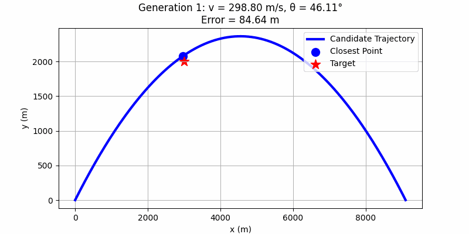

# Projectile Optimization Using Differential Evolution

This project simulates projectile motion and uses a differential evolution algorithm to optimize the launch parameters (speed and angle) so that the projectile hits a specified target location. The target is defined by both an x and a y coordinate.

## Physics Background

### Projectile Motion Equations

When a projectile is launched with an initial speed \( v \) at an angle \( \theta \) from the horizontal, its motion (ignoring air resistance) is governed by the following equations:

- **Horizontal Motion:**
  \[
  x(t) = v \cos(\theta) \cdot t
  \]
- **Vertical Motion:**
  \[
  y(t) = v \sin(\theta) \cdot t - \frac{1}{2} g t^2
  \]
  where \( g = 9.81 \, \text{m/s}^2 \) is the gravitational acceleration.

### Time of Flight

The total time \( T \) the projectile is in the air (until it returns to the ground, i.e. \( y=0 \)) is given by:
\[
T = \frac{2 v \sin(\theta)}{g}
\]

Using these equations, the code simulates the trajectory of the projectile by computing the \( x \) and \( y \) positions over time.

## Code Overview

The code is organized into several key functions:

- **`simulate_trajectory(v, theta, num_points=200)`**  
  Simulates the projectile's trajectory by computing arrays of \( x \) and \( y \) positions from \( t = 0 \) to the time of flight \( T \).

- **`objective(params)`**  
  For a candidate solution (a pair \([v, \theta]\)), this function simulates the projectile’s trajectory and calculates the squared distance between each point on the trajectory and the target (defined by `target_x` and `target_y`). It then returns the minimum squared distance as the error value, which the optimization process aims to minimize.

- **`optimize_projectile()`**  
  Uses SciPy’s `differential_evolution` algorithm to optimize the projectile’s launch parameters. It:

  - Records the best candidate parameters from each generation.
  - Generates a GIF that visualizes the optimization progress. Each frame shows:
    - The candidate trajectory.
    - The target location.
    - The point on the trajectory that is closest to the target.

  To slow down the animation, the code uses two parameters:

  - `frame_duration`: the delay (in seconds) each frame is shown in the GIF.
  - `dup_factor`: duplicates each frame several times to further slow the playback.

## How to Run

### Prerequisites

Make sure you have Python 3 and the following packages installed:

- **NumPy**
- **Matplotlib**
- **SciPy**
- **Imageio**

You can install the required packages using pip:

```bash
pip install numpy matplotlib scipy imageio
```

### Running the Script

Save the code to a file (e.g., `projectile_optimization.py`) and run:

```bash
python projectile_optimization.py
```

This will execute the optimization process and generate a GIF named `optimization.gif` in the working directory.

## Visualization

Below is an example of the GIF generated by the optimization process. The GIF shows the evolution of candidate trajectories over successive generations until the optimizer converges (or completes all iterations).



## Code Listing

```python
import numpy as np
import matplotlib.pyplot as plt
from scipy.optimize import differential_evolution
import imageio
import os

# Constants
g = 9.81                      # gravitational acceleration (m/s^2)
target_x = 1700               # target x-coordinate (m)
target_y = 1000               # target y-coordinate (m)

def simulate_trajectory(v, theta, num_points=200):
    """
    Simulate the projectile trajectory from t=0 until landing (when y=0)
    using the time-of-flight formula: T = 2*v*sin(theta)/g.
    Returns arrays of x and y coordinates.
    """
    T = 2 * v * np.sin(theta) / g  # time-of-flight (until ground hit)
    t = np.linspace(0, T, num_points)
    x = v * np.cos(theta) * t
    y = v * np.sin(theta) * t - 0.5 * g * t**2
    return x, y

def objective(params):
    """
    For a candidate (v, theta), simulate the trajectory and compute the
    minimum squared distance between any point on the trajectory and the target.
    """
    v, theta = params
    x, y = simulate_trajectory(v, theta)
    errors = (x - target_x)**2 + (y - target_y)**2
    return np.min(errors)

def optimize_projectile():
    """
    Use differential evolution to search for the best (v, theta) solution to
    minimize the distance between the projectile trajectory and a target
    at (target_x, target_y). The best candidate from each generation is recorded,
    and a GIF is generated to visualize the optimization progress.
    """
    history = []            # To store candidate parameters from each generation
    early_stop_tol = 1e-6   # Squared error tolerance for early stopping

    def callback(xk, convergence):
        history.append(xk.copy())
        current_error = objective(xk)
        if current_error < early_stop_tol:
            print(f"Stopping early at candidate {xk} with error {current_error:.2e}")
            return True

    # Bounds: speed between 1 and 300 m/s, angle between 1° and 120° (in radians)
    bounds = [(1, 300), (np.deg2rad(1), np.deg2rad(120))]

    result = differential_evolution(
        objective,
        bounds,
        callback=callback,
        disp=True,
        maxiter=200,    # Force a fixed number of iterations
        tol=0.0,        # No convergence tolerance to stop early internally
        polish=False    # Disable final polishing
    )
    best_v, best_theta = result.x

    print("\nDifferential Evolution Optimization Result:")
    print(f"  Best v     : {best_v:.2f} m/s")
    print(f"  Best theta : {np.degrees(best_theta):.2f}°")
    x_best, y_best = simulate_trajectory(best_v, best_theta)
    errors = (x_best - target_x)**2 + (y_best - target_y)**2
    best_error = np.sqrt(np.min(errors))
    print(f"  Minimum distance error: {best_error:.2f} m")

    # Create a GIF from the recorded history.
    gif_frames = []
    # Increase the per-frame duration to slow down the animation (in seconds)
    frame_duration = 2.0
    # Duplicate each frame to further slow the playback
    dup_factor = 5

    for i, params in enumerate(history):
        v, theta = params
        x, y = simulate_trajectory(v, theta)
        errors = (x - target_x)**2 + (y - target_y)**2
        min_index = np.argmin(errors)
        hit_x = x[min_index]
        hit_y = y[min_index]
        error_distance = np.sqrt(errors[min_index])

        plt.figure(figsize=(8, 4))
        # Plot the candidate trajectory
        plt.plot(x, y, color='b', linewidth=3, label="Candidate Trajectory")
        # Mark the closest point on the trajectory to the target
        plt.scatter(hit_x, hit_y, color='b', s=100, marker='o', label="Closest Point")
        # Plot the target
        plt.scatter(target_x, target_y, color='r', s=150, marker='*', label="Target")
        plt.xlabel("x (m)")
        plt.ylabel("y (m)")
        plt.title(f"Generation {i+1}: v = {v:.2f} m/s, θ = {np.degrees(theta):.2f}°\nError = {error_distance:.2f} m")
        plt.legend(loc="upper right")
        plt.grid(True)
        # Save the frame as a temporary image
        filename = f"de_frame_{i}.png"
        plt.savefig(filename)
        plt.close()
        # Read and duplicate the frame for slower playback
        img = imageio.imread(filename)
        for _ in range(dup_factor):
            gif_frames.append(img)
        os.remove(filename)

    gif_filename = "optimization.gif"
    imageio.mimsave(gif_filename, gif_frames, duration=frame_duration)
    print(f"\nOptimization progress GIF saved as '{gif_filename}'")

if __name__ == "__main__":
    optimize_projectile()
```

## Conclusion

This project demonstrates how to integrate physics-based simulation with evolutionary optimization to solve a real-world problem—finding the optimal launch parameters for a projectile to hit a target. Feel free to modify the target coordinates, bounds, and optimization settings to explore different scenarios.

---

You can include the GIF in your repository and reference it in the README as shown above.

Happy coding and optimizing!
