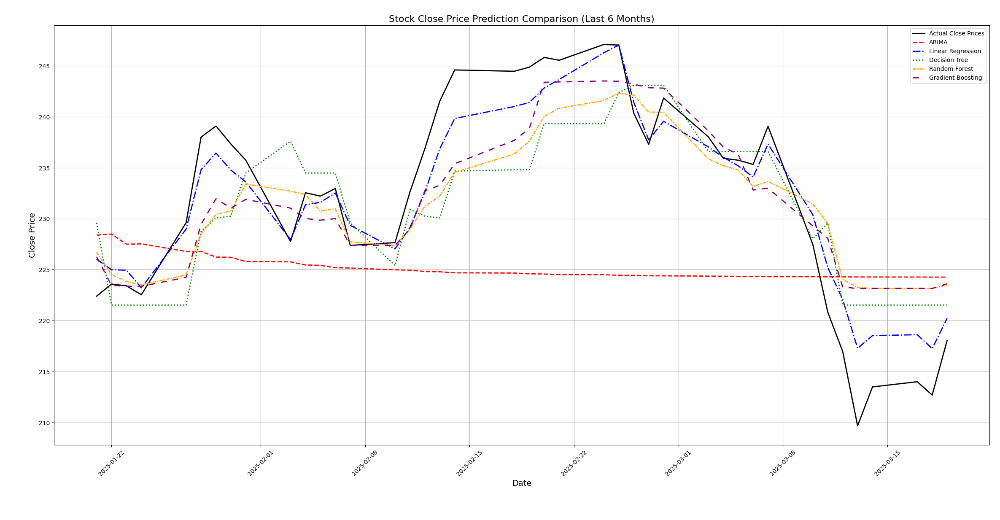

# Stock Price Prediction with Technical Indicators and Multiple Models

This repository contains a Python script that downloads six months of historical stock data for AAPL, performs feature engineering using common technical indicators, and then builds several predictive models to forecast stock close prices. The script splits the data so that the training set covers data prior to the last two months, and the test set includes the most recent two months. In addition to traditional machine learning models, an ARIMA time series model is used for forecasting.



## Table of Contents

- [Overview](#overview)
- [Requirements](#requirements)
- [Data Download](#data-download)
- [Feature Engineering](#feature-engineering)
- [Data Splitting](#data-splitting)
- [Models Used](#models-used)
  - [ARIMA Model](#arima-model)
  - [Machine Learning Models](#machine-learning-models)
- [Plotting Predictions](#plotting-predictions)
- [Evaluation Metrics](#evaluation-metrics)
- [Future Predictions Considerations](#future-predictions-considerations)
- [Usage](#usage)

## Overview

This script demonstrates a workflow for predicting the stock close price using both traditional time series models (ARIMA) and several machine learning models. The approach includes:

- Downloading historical stock data from Yahoo Finance.
- Engineering several technical indicator features such as moving averages, RSI, MACD, etc.
- Splitting the data into training (first 4 months) and test sets (last 2 months).
- Fitting multiple predictive models.
- Plotting the actual versus predicted prices using clear and distinguishable line styles.
- Calculating the Root Mean Squared Error (RMSE) for each model to evaluate performance.

## Requirements

To run the code, ensure you have the following Python libraries installed:

- pandas
- numpy
- yfinance
- matplotlib
- scikit-learn
- statsmodels

You can install them via pip:

```bash
pip install pandas numpy yfinance matplotlib scikit-learn statsmodels
```

## Data Download

The script uses the `yfinance` library to download six months of historical data for Apple Inc. (AAPL):

```python
ticker = 'AAPL'
df = yf.download(ticker, period='6mo')
```

This downloads key stock information such as Open, High, Low, Close, and Volume. The downloaded data is indexed by date.

## Feature Engineering

Several technical indicators are computed to serve as features for the predictive models:

- **Daily Returns:** Percentage change in closing price.
  ```python
  df['Return'] = df['Close'].pct_change()
  ```
- **Moving Averages (MA):** 5-day and 20-day simple moving averages.
  ```python
  df['MA_5'] = df['Close'].rolling(window=5).mean()
  df['MA_20'] = df['Close'].rolling(window=20).mean()
  ```
- **Exponential Moving Average (EMA):** 10-day exponential moving average.
  ```python
  df['EMA_10'] = df['Close'].ewm(span=10, adjust=False).mean()
  ```
- **Volatility:** Rolling standard deviation of the daily returns over a 10-day window.
  ```python
  df['Volatility'] = df['Return'].rolling(window=10).std()
  ```
- **Momentum:** Difference between the current close price and the close price 10 days prior.
  ```python
  df['Momentum'] = df['Close'] - df['Close'].shift(10)
  ```
- **Relative Strength Index (RSI):** A momentum oscillator that measures the speed and change of price movements.
  ```python
  delta = df['Close'].diff()
  up = delta.clip(lower=0)
  down = -1 * delta.clip(upper=0)
  ema_up = up.ewm(com=13, adjust=False).mean()
  ema_down = down.ewm(com=13, adjust=False).mean()
  rs = ema_up / ema_down
  df['RSI'] = 100 - (100 / (1 + rs))
  ```
- **MACD and Signal Line:**
  - **MACD:** Difference between the 12-day and 26-day EMAs.
  - **Signal Line:** 9-day EMA of the MACD.
  ```python
  exp1 = df['Close'].ewm(span=12, adjust=False).mean()
  exp2 = df['Close'].ewm(span=26, adjust=False).mean()
  df['MACD'] = exp1 - exp2
  df['Signal_Line'] = df['MACD'].ewm(span=9, adjust=False).mean()
  ```

After computing these indicators, any rows containing NaN values (due to the rolling calculations) are removed:

```python
df.dropna(inplace=True)
```

The final feature set used for predictions is:

```python
features = ['MA_5', 'MA_20', 'EMA_10', 'Volatility', 'Momentum', 'RSI', 'MACD', 'Signal_Line']
```

## Data Splitting

The data is split into training and test sets based on time. The training set includes all data before the last two months, while the test set consists of the last two months of data:

```python
test_start_date = df.index.max() - DateOffset(months=2)
train_df = df[df.index < test_start_date]
test_df = df[df.index >= test_start_date]

X_train = train_df[features]
y_train = train_df['Close']
X_test = test_df[features]
y_test = test_df['Close']
```

This ensures that the models are trained on historical data and evaluated on the most recent data.

## Models Used

### ARIMA Model

The ARIMA (AutoRegressive Integrated Moving Average) model is a popular time series forecasting method. It is used here to forecast the closing prices based solely on the historical closing price data:

```python
arima_order = (2, 1, 2)
arima_model = sm.tsa.ARIMA(y_train, order=arima_order).fit()
arima_predictions = arima_model.forecast(steps=len(y_test))
```

The model is trained on the training set and then used to forecast the close prices for the test period.

### Machine Learning Models

Four machine learning models are also used to predict the close prices using the engineered features:

- **Linear Regression**
- **Decision Tree Regressor**
- **Random Forest Regressor**
- **Gradient Boosting Regressor**

Each model is fitted on the training set and then used to predict on the test set:

```python
models = {
    'Linear Regression': LinearRegression(),
    'Decision Tree': DecisionTreeRegressor(random_state=0),
    'Random Forest': RandomForestRegressor(n_estimators=100, random_state=0),
    'Gradient Boosting': GradientBoostingRegressor(n_estimators=100, random_state=0)
}

predictions = {'ARIMA': arima_predictions}

for name, model in models.items():
    model.fit(X_train, y_train)
    predictions[name] = model.predict(X_test)
```

## Plotting Predictions

The predictions from all models, along with the actual close prices from the test set, are plotted. The plot includes:

- **X-Axis:** Actual dates from the test set.
- **Y-Axis:** Closing prices.
- **Distinct Colors and Line Styles:** To differentiate between the actual values and predictions from various models.

```python
plt.figure(figsize=(14, 8))
plt.plot(y_test.index, y_test.values, label='Actual Close Prices', color='black', linewidth=2)

colors = ['red', 'blue', 'green', 'orange', 'purple']
linestyles = ['--', '-.', ':', (0, (3, 1, 1, 1)), (0, (5, 5))]

for (model_name, pred_values), color, ls in zip(predictions.items(), colors, linestyles):
    plt.plot(y_test.index, pred_values, label=model_name, color=color, linestyle=ls, linewidth=2)

plt.title('Stock Close Price Prediction Comparison (Last 6 Months)', fontsize=16)
plt.xlabel('Date', fontsize=14)
plt.ylabel('Close Price', fontsize=14)
plt.xticks(rotation=45)
plt.legend()
plt.grid(True)
plt.tight_layout()
plt.show()
```

## Evaluation Metrics

The Root Mean Squared Error (RMSE) is calculated for each model's predictions on the test set to evaluate their performance:

```python
print("Root Mean Squared Error (RMSE):")
for model_name, pred_values in predictions.items():
    rmse = np.sqrt(mean_squared_error(y_test, pred_values))
    print(f"{model_name}: {rmse:.4f}")
```

## Future Predictions Considerations

While ARIMA can be used to forecast future values (e.g., one month after the last date) without additional feature requirements, machine learning models that use technical indicators need the future values of these indicators. For multi-day-ahead predictions using these models, you must either:

- **Iterative Forecasting:** Predict one day ahead, update indicators, and then predict the next day. This can lead to error accumulation.
- **Direct Multi-step Forecasting:** Train models to directly forecast multiple future days, though you may need to simulate or predict the indicator values for those days.

## Usage

1. **Clone the repository and navigate to the project folder.**
2. **Ensure all required packages are installed.**
3. **Run the script using Python:**

   ```bash
   python your_script_name.py
   ```

The script will download the latest 6-month data for AAPL, engineer features, split the data into training (first 4 months) and testing (last 2 months), build models, and then display the prediction comparison plot along with RMSE for each model.

---

This README should provide all the necessary context and details to understand the workflow, model choices, and how the code processes the stock data from download through to prediction and evaluation.
