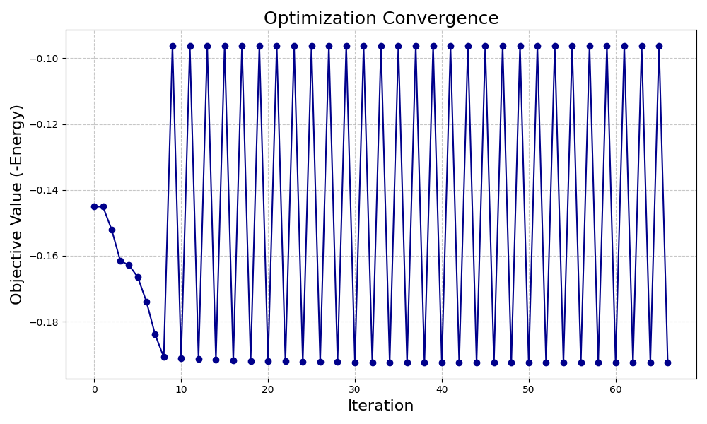
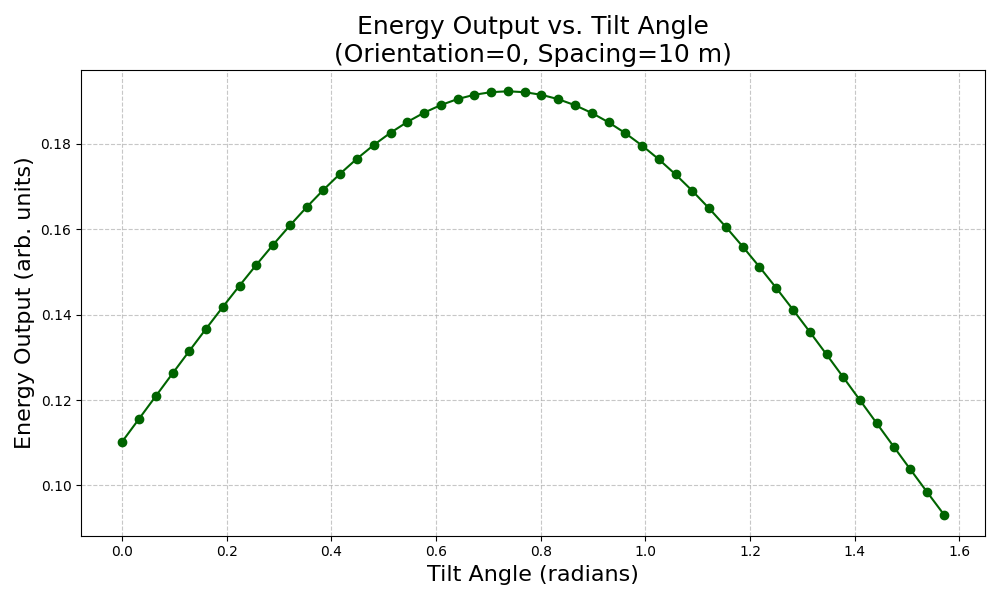
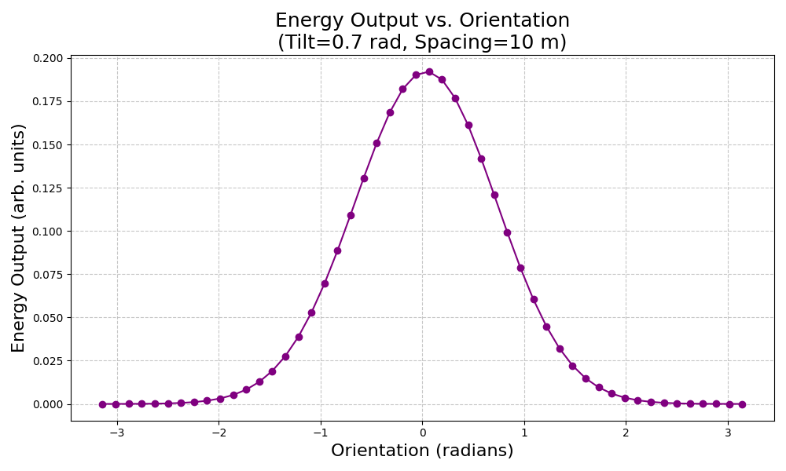
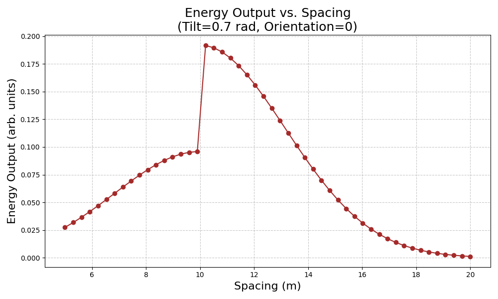
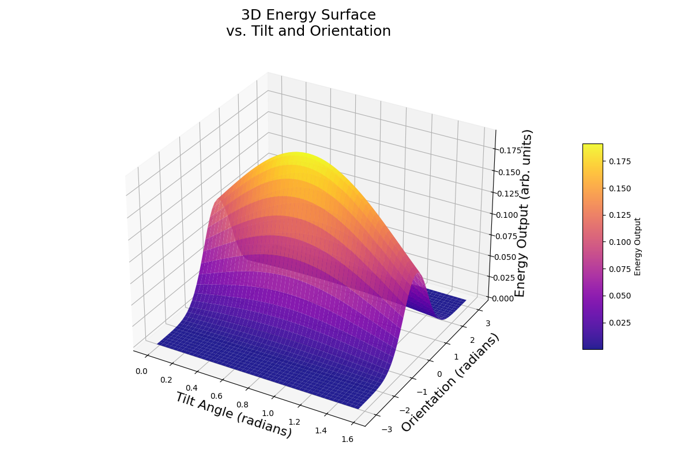

# Solar Panel Array Optimization Project

## Background

Solar energy is one of the most promising renewable energy sources available today. However, the performance of a solar panel system depends on several factors, such as:

- **Tilt:** The angle at which the panels are inclined.
- **Orientation:** The direction the panels face.
- **Spacing:** The distance between panels to avoid shading.

Our project aims to find the best combination of these factors to maximize the energy output of a solar panel array. Using a simulation-based approach and optimization techniques, we adjust these design variables to reach the optimal configuration.

---

## Project Description

In this project, we use a simple mathematical model to simulate the energy output of a solar panel system. The simulation estimates energy based on:

- **Tilt (in radians)**
- **Orientation (in radians)**
- **Spacing (in meters)**
- **Panel Efficiency**

We then use an optimizer (SLSQP via the OpenMDAO framework) to automatically adjust these variables and find the best configuration that produces the highest energy output.

---

## Code Explanation

### 1. Simulation Component

- **What It Does:**  
  The class `SolarPanelSim` is our "calculator." It takes in the design variables (tilt, orientation, spacing, panel efficiency) and computes an estimated energy output using a simple formula.

- **How It Works:**
  - **Optimal Values:**  
    The energy is highest when the tilt is around 0.7 radians, orientation is around 0 radians, and spacing is around 10 meters.
  - **Mathematical Function:**  
    The code uses an exponential (Gaussian-like) function to mimic how energy falls off when the design moves away from these optimal values. A small sine-based "seasonal factor" adds minor variations.
  - **Spacing Penalty:**  
    If panels are too close, the energy output is reduced to simulate shading effects.

### 2. Problem Setup with OpenMDAO

- **Independent Variables:**  
  We define initial guesses for tilt, orientation, spacing, and efficiency.

- **Connecting Components:**  
  Our simulation component (`SolarPanelSim`) is added to the model. An additional component calculates the negative of the energy so that minimizing this value (the default behavior of the optimizer) actually maximizes the energy.

- **Optimization:**  
  We use the SLSQP optimizer, which systematically adjusts the variables within set limits (bounds) to find the best (optimal) design.

### 3. Visualization

After running the optimization, the code creates several plots to help us understand the process and results:

- **N2 Diagram:**  
  A diagram showing how all the parts of our model are connected.

- **Convergence Plot:**  
  A graph that displays how the optimizer improved the design over each iteration. The x-axis represents the iteration number, and the y-axis shows the objective value (negative energy).

- **Design Space Plots:**  
  These are simple 2D line graphs showing:

  - **Energy vs. Tilt:** How energy output changes when only the tilt is varied (keeping orientation and spacing fixed).
  - **Energy vs. Orientation:** How energy output changes when only the orientation is varied (with tilt and spacing fixed).
  - **Energy vs. Spacing:** How energy output changes when only the spacing is varied (with tilt and orientation fixed).

- **3D Surface Plot:**  
  A three-dimensional plot that visualizes energy output as both tilt and orientation change (with spacing fixed). Imagine it as a 3D hill where the highest peak represents the best configuration.

---

## Mathematical Explanation

Our energy model is designed to mimic real-world behavior in a very simple way. Here’s a plain-language breakdown:

- **Energy Calculation:**  
  The energy output is given by a formula that involves:
  - **Panel Efficiency:** A multiplier that represents how well the panels convert sunlight.
  - **Exponential Functions:** These functions give the highest energy when the tilt is near 0.7 radians and the orientation is near 0 radians. Think of it as a smooth hill where the peak is the best design.
  - **Seasonal Factor:** A small sine function adds tiny variations (as if the sun’s path changes slightly over time).
  - **Spacing Penalty:** If the panels are placed too close together, they shade each other, and the energy output drops.

In simple terms, the formula creates a “landscape” where the highest point (the peak) represents the optimal settings. As you move away from this peak (by changing tilt, orientation, or spacing), the energy output decreases.

## Model Explanation

### 1. Panel Efficiency

- **What it is:**  
  A constant value (for example, 0.18 means 18% efficient) that represents how effectively the panels convert sunlight into energy.
- **Role in the Formula:**  
  It multiplies the entire energy calculation, scaling the result according to the inherent efficiency of the panels.

### 2. Exponential Component: `np.exp(...)`

- **Purpose:**  
  This part creates a smooth, bell-shaped (Gaussian-like) curve. It represents a “landscape” where the highest point (peak) is the optimal configuration.
- **Inside the Exponential:**
  - **`-((tilt - optimum_tilt)**2)`:\*\*  
    Measures the difference between the current tilt and the ideal (optimal) tilt (around 0.7 radians). Squaring the difference makes sure that even small deviations result in a lower energy value.
  - **`-((orientation - optimum_orientation)**2)`:\*\*  
    Similarly, this term measures how far the current orientation is from the optimal orientation (around 0 radians). Again, squaring the difference penalizes any deviation.
  - **`+ seasonal_factor`:**  
    Adds a small, periodic variation (using a sine function) to simulate minor seasonal effects. Think of it as a gentle nudge that slightly adjusts the energy output.
  - **`- 0.05 \* (spacing - optimum_spacing)**2`:\*\*  
    Calculates how far the current spacing is from the optimal spacing (around 10 meters). The factor 0.05 reduces the impact of spacing differences compared to tilt and orientation. This term penalizes too little or too much spacing by lowering the energy output.

### 3. Spacing Penalty

- **What it is:**  
  A multiplier (for example, 1.0 for ideal spacing, or 0.5 if panels are too close) that reduces the energy output if the panels are placed too near each other.
- **Role in the Formula:**  
  Even if tilt and orientation are optimal, insufficient spacing can cause shading, so this penalty further adjusts the energy output to reflect that.

### Overall Intuition Behind the Model

- **Optimal Conditions:**  
  The model is designed so that when tilt, orientation, and spacing are at their ideal values, the exponential term reaches its maximum. This creates a “peak” in our energy landscape.
- **Deviation from the Optimum:**  
  As any of these parameters move away from their optimal values, the squared differences increase, causing the exponential term to drop off rapidly. This means the energy output decreases, simulating the real-world effect of suboptimal panel positioning.
- **Scaling by Efficiency and Spacing Penalty:**  
  Finally, the energy is scaled by the panel efficiency and adjusted by the spacing penalty to give a realistic estimate of the solar panel system's performance.

In simple terms, this formula creates a hill-like landscape where the highest point represents the best possible settings for the solar panel array. As you move away from this peak (by changing the tilt, orientation, or spacing), the energy output falls off, just like climbing down a hill.

## Explanation of the Plots

### 1. N2 Diagram

- **Description:**  
  This diagram visually represents the structure of the project. It shows how the independent variables, simulation component, and objective function are connected.
- **Usage:**  
  Open the `model_diagram.html` file in your browser to see a schematic of the model.

### 2. Convergence Plot

- **Description:**  
  This line graph shows how the optimization process improves the design over time.
- **What to Look For:**  
  The plot should show a trend of decreasing negative energy (which means increasing actual energy).
- **Image:**  
  

### 3. Energy vs. Tilt Plot

- **Description:**  
  This plot shows how the energy output changes as the tilt angle varies (with orientation and spacing kept constant).
- **What to Look For:**  
  The peak of the graph indicates the optimal tilt, which is near 0.7 radians.
- **Image:**  
  

### 4. Energy vs. Orientation Plot

- **Description:**  
  This plot displays how energy output varies when only the orientation is changed (with tilt and spacing constant).
- **What to Look For:**  
  The best energy output is achieved when the orientation is around 0 radians.
- **Image:**  
  

### 5. Energy vs. Spacing Plot

- **Description:**  
  This graph shows the change in energy output as the spacing between panels is varied (with tilt and orientation constant).
- **What to Look For:**  
  The optimal spacing is around 10 meters, where the energy output is highest.
- **Image:**  
  

### 6. 3D Surface Plot

- **Description:**  
  A 3D visualization that shows energy output as a function of both tilt and orientation while keeping spacing fixed.
- **What to Look For:**  
  The highest peak on this surface represents the optimal combination of tilt and orientation.
- **Image:**  
  

---

## How to Run the Project

1. **Install Dependencies:**

   Ensure you have Python installed along with the required packages. You can install them using pip:

   ```bash
   pip install openmdao numpy matplotlib
   ```

2. **Run the Code:**

   Save the provided code in a file (e.g., `solar_panel_optimization.py`) and run:

   ```bash
   python solar_panel_optimization.py
   ```

3. **View the Outputs:**

   - **Model Diagram:** Open `model_diagram.html` in your browser.
   - **Plots:** Check the generated image files:
     - `convergence_plot.png`
     - `energy_vs_tilt.png`
     - `energy_vs_orientation.png`
     - `energy_vs_spacing.png`
     - `energy_surface.png`

---

## Summary

This project combines physics, math, and optimization to design a solar panel array that maximizes energy output. We use a simulation model to estimate energy, then an optimizer to find the best settings for tilt, orientation, and spacing. Finally, several graphs help visualize the process and results in an easy-to-understand manner—even for someone without a technical background.

Enjoy exploring the optimal design for solar energy capture!

---
