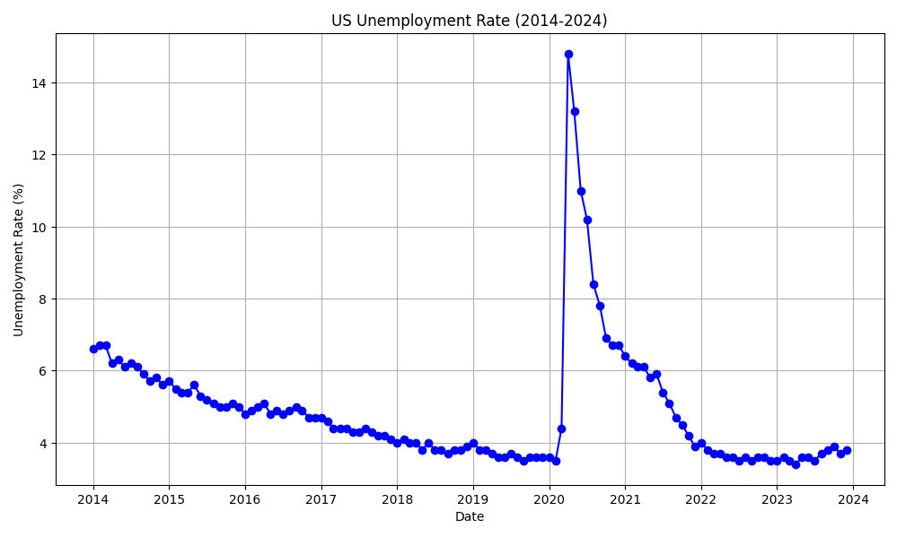
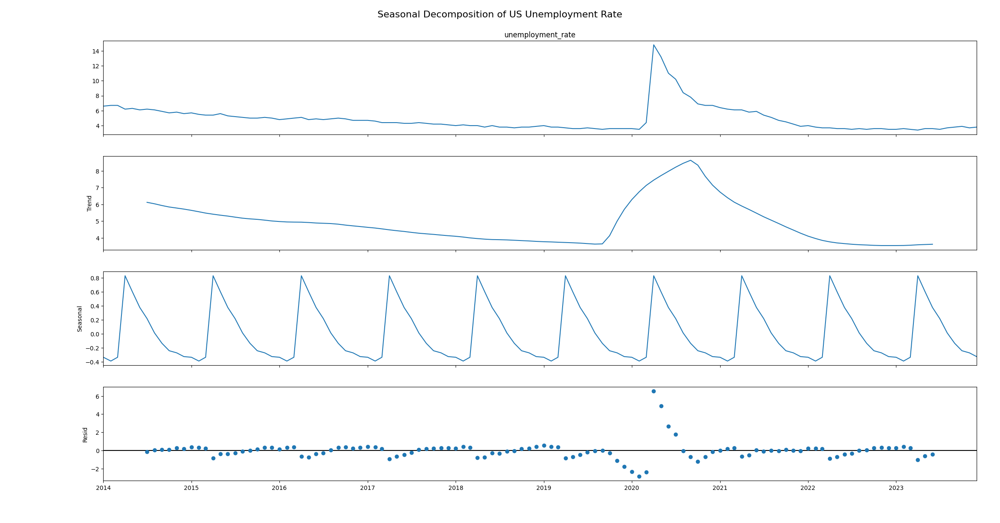
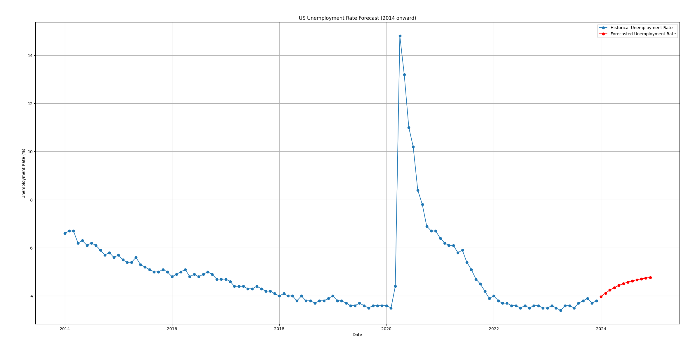

# US Unemployment Rate Analysis (2014 - 2024)

This project retrieves monthly U.S. unemployment rate data from the Bureau of Labor Statistics (BLS) API starting from 2014, then applies seasonal decomposition and an ARIMA model to forecast future unemployment rates. Below, you’ll find details about what the unemployment rate is, why it matters, the observed trends, an explanation of the decomposition plots, and how to interpret the forecast.

---

## 1. What Does the Unemployment Rate Mean and How Does It Affect Us?

The **unemployment rate** is the percentage of the total workforce that is not employed but is actively seeking employment. It’s one of the most closely watched indicators because:

- **Economic Health:** A rising unemployment rate can signal an economic downturn, while a falling rate often suggests growth or recovery.
- **Personal Impact:** Higher unemployment can lead to reduced consumer spending, affecting businesses and household finances.
- **Policy Decisions:** Governments and central banks often adjust policies (like interest rates or stimulus measures) in response to unemployment trends to stabilize the economy.

---

## 2. Trends of Employment: Record High in 2020 and Mid-2021

Below is the **Historical Unemployment Rate** plot from 2014 through mid-2024. Notice how unemployment spiked dramatically around 2020, reflecting the economic impact of the global pandemic, and began to decline afterward.



- **Record High in 2020:** The COVID-19 pandemic led to widespread business closures and layoffs, causing unemployment to surge.
- **Gradual Decline:** As economies reopened and recovery measures took effect, the unemployment rate steadily declined, reaching more typical levels by 2022–2023.

---

## 3. Seasonal Decomposition: Trend, Seasonal, and Residual Components

We applied a **seasonal decomposition** (using an additive model) to break down the unemployment rate into three main components:



1. **Trend:** Shows the long-term movement or direction of the data (e.g., rising, falling). In this plot, you can observe how unemployment trended upward sharply around 2020 and gradually fell afterward.
2. **Seasonal:** Reflects the regular, repeating fluctuations that occur within a specific period (e.g., monthly or yearly). In unemployment data, certain times of the year may see small cyclical shifts in hiring or layoffs.
3. **Residual (or Remainder):** The “noise” or the portion of the data that isn’t explained by the trend or seasonal components. Ideally, residuals should appear random without clear patterns, indicating the model is capturing most systematic movements in the data.

Reading this decomposition helps you see if unemployment changes are driven by long-term trends, short-term seasonal factors, or unpredictable events (like sudden economic shocks).

---

## 4. Forecast: What It Tells Us and How to Read the Plot

Using an **ARIMA model**, we forecast the unemployment rate for the next 12 months. Below is the **Forecast Plot** where the historical data is shown in blue, and the forecasted values appear in red:



- **Model-Based Projection:** The ARIMA model uses historical patterns in the unemployment rate (trend, seasonality, and past errors) to project future values.
- **Uncertainty:** While forecasts offer insight, they’re subject to uncertainties—shifts in economic policy, unexpected global events, or major technological changes can alter real-world outcomes significantly.
- **Interpretation:** If the red line continues a gradual climb or decline, it suggests a moderate trend in unemployment. However, keep in mind that real data may deviate from model predictions if new factors emerge.

---

### How to Run This Project

1. **Install Dependencies:**

   ```bash
   pip install pandas requests matplotlib statsmodels
   ```

2. **Run the Script:**
   ```bash
   python unemployment_forecast.py
   ```
3. **View the Plots:**  
   The script generates three main plots:
   - Historical Unemployment Rate
   - Seasonal Decomposition
   - Forecast Plot

Open the generated images or inline plots in your Python environment (e.g., Jupyter notebook, or a local script that shows the matplotlib windows).

---

## License

This project is provided under the [MIT License](LICENSE).

---
